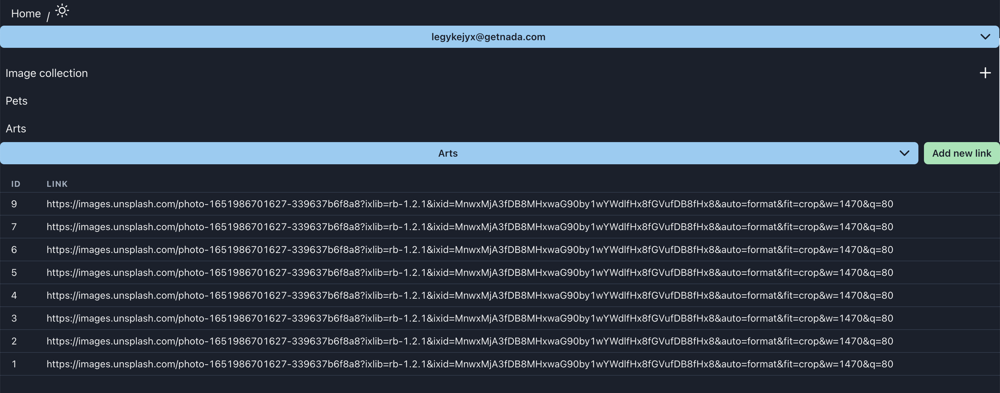

# [IMAGE UPLOADER APPLICATION](https://image-uploader-murex.vercel.app/)

[](https://github.com/prettier/prettier)
[](https://github.com/merima98/ASK-app-client/blob/main/LICENSE)



### Getting started

```
    git clone https://github.com/merima98/image-uploader.git
    cd image-uploader
    yarn install
    yarn start
```

### License

[MIT](./LICENSE)
